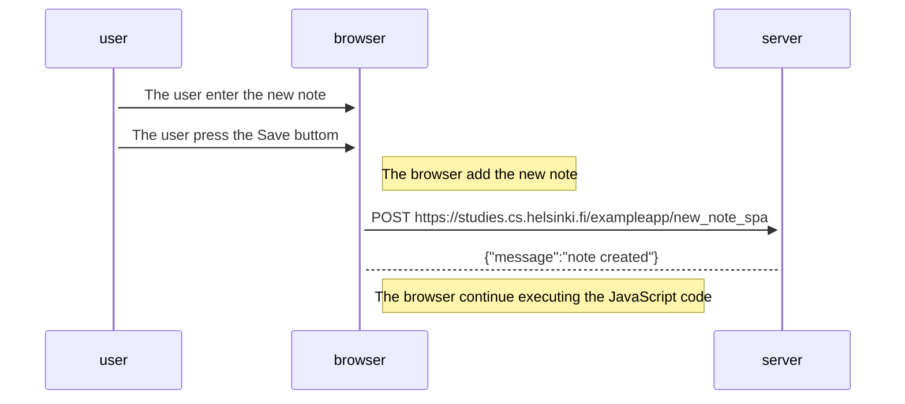

```mermaid
sequenceDiagram
    participant user
    participant browser
    participant server
    
    activate user
    activate browser
    activate server
    user->>browser: The user enter the new note

    user->>browser: The user press the Save buttom
    Note right of browser: The browser add the new note
    browser->>server: POST https://studies.cs.helsinki.fi/exampleapp/new_note_spa
    server-->browser: {"message":"note created"}

    Note right of browser: The browser continue executing the JavaScript code
```

